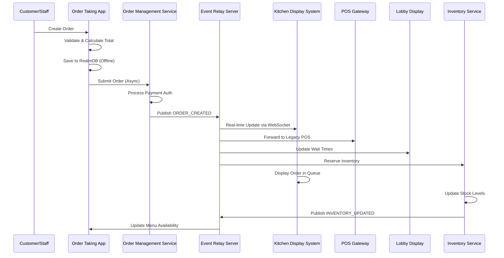

*30th Jan 2026*

____

# **Dominos POS System - Complete System Architecture Documentation**

## **Executive Summary**
This document provides comprehensive HLD and LLD documentation for the Dominos POS ecosystem, covering 11 interconnected applications with a focus on real-time operations, offline capabilities, and seamless integration.

---

## **1. HIGH-LEVEL DESIGN (HLD)**

### **1.1 System Context Diagram**

```
┌─────────────────────────────────────────────────────────────────────────────┐
│                          External Systems & Users                           │
├────────────────┬────────────────┬────────────────┬─────────────────────────┤
│   Customers    │ Store Staff    │  HQ Managers   │   External Services     │
│    (Mobile)    │ (Various Apps) │  (Backoffice)  │                         │
├────────────────┼────────────────┼────────────────┼─────────────────────────┤
│ • Order App    │ • Order Taking │ • Inventory    │ • Payment Gateways      │
│ • Web Orders   │ • Kitchen Disp │ • Reporting    │ • Delivery Partners     │
│ • Menu Boards  │ • Lobby Disp   │ • Analytics    │ • Supplier Systems      │
│                │ • Inventory    │                │ • Corporate BI          │
└────────────────┴────────────────┴────────────────┴─────────────────────────┘
                              │
                              ▼
┌─────────────────────────────────────────────────────────────────────────────┐
│                     DOMINOS POS SYSTEM BOUNDARY                             │
├─────────────────────────────────────────────────────────────────────────────┤
│                                                                             │
│  ┌────────────┐  ┌────────────┐  ┌────────────┐  ┌────────────┐           │
│  │   Mobile   │  │  Web Apps  │  │  Display   │  │ Backend    │           │
│  │  Frontend  │  │   (CMS,    │  │  Systems   │  │ Services   │           │
│  │            │  │  Backoffice)│  │(Kitchen/  │  │            │           │
│  │            │  │             │  │ Lobby/Menu)│  │            │           │
│  └────────────┘  └────────────┘  └────────────┘  └────────────┘           │
│         │               │               │               │                  │
│         └───────────────┼───────────────┼───────────────┘                  │
│                         │               │                                  │
│  ┌────────────────────────────────────────────────────────────┐            │
│  │                    Integration Layer                       │            │
│  │  ┌────────────┐  ┌────────────┐  ┌────────────────────┐   │            │
│  │  │   API      │  │   Event    │  │   POS Gateway      │   │            │
│  │  │  Gateway   │  │   Relay    │  │   Service/Adapter  │   │            │
│  │  └────────────┘  └────────────┘  └────────────────────┘   │            │
│  └────────────────────────────────────────────────────────────┘            │
│                         │               │                                  │
│  ┌────────────────────────────────────────────────────────────┐            │
│  │                    Data & Storage Layer                    │            │
│  │  ┌────────────┐  ┌────────────┐  ┌────────────────────┐   │            │
│  │  │  Primary   │  │  Analytics │  │   Offline/Sync     │   │            │
│  │  │  Database  │  │   DB/Data  │  │   Storage (Realm)  │   │            │
│  │  │            │  │   Warehouse│  │                    │   │            │
│  │  └────────────┘  └────────────┘  └────────────────────┘   │            │
│  └────────────────────────────────────────────────────────────┘            │
└─────────────────────────────────────────────────────────────────────────────┘
```

### **1.2 Container Diagram**

```
┌─────────────────────────────────────────────────────────────────────────────┐
│                        APPLICATION CONTAINERS                               │
├─────────────────┬─────────────────┬─────────────────┬──────────────────────┤
│   Frontend      │   Display       │   Backend       │   Integration        │
│   Containers    │   Containers    │   Services      │   Containers         │
├─────────────────┼─────────────────┼─────────────────┼──────────────────────┤
│ • Order Taking  │ • Kitchen       │ • Order Mgmt    │ • API Gateway        │
│   App           │   Display Web   │   Service       │   (Kong/nginx)       │
│   (React Native)│ • Lobby Display │ • Event Relay   │ • Event Relay        │
│ • Inventory CMS │   System        │   Server        │   Server (RabbitMQ   │
│   (React)       │ • Digital Menu  │ • POS Gateway   │   /Kafka Proxy)      │
│ • Backoffice    │   Board Web     │   Service       │ • POS Gateway        │
│   System Web    │                 │ • Reporting     │   Adapter            │
│                 │                 │   Service       │                      │
└─────────────────┴─────────────────┴─────────────────┴──────────────────────┘
         │                 │                 │                 │
         └─────────────────┼─────────────────┼─────────────────┘
                           │                 │
┌─────────────────────────────────────────────────────────────────────────────┐
│                        DATA STORES & EXTERNAL SYSTEMS                       │
├─────────────────┬─────────────────┬─────────────────┬──────────────────────┤
│   Primary       │   Analytics     │   Real-time     │   External           │
│   Databases     │   Stores        │   Stores        │   Services           │
├─────────────────┼─────────────────┼─────────────────┼──────────────────────┤
│ • PostgreSQL    │ • ClickHouse    │ • Redis         │ • Payment Processors│
│   (Orders,      │   (Reporting)   │   (Session,     │ • Delivery APIs      │
│   Inventory)    │ • TimescaleDB   │   Cache)        │ • Supplier Portals   │
│ • MongoDB       │   (Time-series) │ • RealmDB       │ • Corporate ERP      │
│   (Menu,        │ • Elasticsearch │   (Mobile Sync) │   Systems            │
│   CMS Content)  │   (Logs/Search) │ • WebSocket     │                      │
│                 │                 │   Connections   │                      │
└─────────────────┴─────────────────┴─────────────────┴──────────────────────┘
```

### **1.3 Component Diagram (Aggregated View)**

```
┌─────────────────────────────────────────────────────────────────────────────┐
│                     COMPONENT ARCHITECTURE OVERVIEW                         │
├─────────────────────────────────────────────────────────────────────────────┤
│                                                                             │
│  ┌─────────────────────────────────────────────────────────────────────┐   │
│  │                    PRESENTATION LAYER                               │   │
│  │  ┌──────────┐ ┌──────────┐ ┌──────────┐ ┌──────────┐ ┌──────────┐  │   │
│  │  │   UI     │ │   UI     │ │   UI     │ │   UI     │ │   UI     │  │   │
│  │  │ Components│ │ Components│ │ Components│ │ Components│ │ Components│  │
│  │  └──────────┘ └──────────┘ └──────────┘ └──────────┘ └──────────┘  │   │
│  │          │           │           │           │           │          │   │
│  │  ┌────────────────────────────────────────────────────────────┐     │   │
│  │  │                    STATE MANAGEMENT                        │     │   │
│  │  │  ┌──────────┐ ┌──────────┐ ┌──────────┐ ┌──────────┐      │     │   │
│  │  │  │  Redux   │ │  Context │ │ MobX/    │ │  Local   │      │     │   │
│  │  │  │  Stores  │ │  API     │ │ Observable│ │  State   │      │     │   │
│  │  │  └──────────┘ └──────────┘ └──────────┘ └──────────┘      │     │   │
│  │  └────────────────────────────────────────────────────────────┘     │   │
│  └─────────────────────────────────────────────────────────────────────┘   │
│                                     │                                      │
│  ┌─────────────────────────────────────────────────────────────────────┐   │
│  │                    SERVICE LAYER                                   │   │
│  │  ┌──────────┐ ┌──────────┐ ┌──────────┐ ┌──────────┐ ┌──────────┐  │   │
│  │  │   API    │ │   Web-   │ │  Event   │ │   Sync   │ │   Cache  │  │   │
│  │  │  Clients │ │  Socket  │ │ Handlers │ │  Service │ │  Service │  │   │
│  │  └──────────┘ └──────────┘ └──────────┘ └──────────┘ └──────────┘  │   │
│  └─────────────────────────────────────────────────────────────────────┘   │
│                                     │                                      │
│  ┌─────────────────────────────────────────────────────────────────────┐   │
│  │                    BUSINESS LAYER                                  │   │
│  │  ┌──────────┐ ┌──────────┐ ┌──────────┐ ┌──────────┐ ┌──────────┐  │   │
│  │  │  Order   │ │Inventory │ │  Menu    │ │ Payment  │ │ Delivery │  │   │
│  │  │  Mgmt    │ │  Mgmt    │ │  Mgmt    │ │  Mgmt    │ │  Mgmt    │  │   │
│  │  └──────────┘ └──────────┘ └──────────┘ └──────────┘ └──────────┘  │   │
│  └─────────────────────────────────────────────────────────────────────┘   │
│                                     │                                      │
│  ┌─────────────────────────────────────────────────────────────────────┐   │
│  │                    DATA ACCESS LAYER                               │   │
│  │  ┌──────────┐ ┌──────────┐ ┌──────────┐ ┌──────────┐ ┌──────────┐  │   │
│  │  │   ORM/   │ │  Query   │ │  Cache   │ │  Realm   │ │  File    │  │   │
│  │  │  ODM     │ │ Builders │ │  Layer   │ │  Sync    │ │  Storage │  │   │
│  │  └──────────┘ └──────────┘ └──────────┘ └──────────┘ └──────────┘  │   │
│  └─────────────────────────────────────────────────────────────────────┘   │
│                                     │                                      │
│  ┌─────────────────────────────────────────────────────────────────────┐   │
│  │                    PERSISTENCE LAYER                               │   │
│  │  ┌──────────┐ ┌──────────┐ ┌──────────┐ ┌──────────┐ ┌──────────┐  │   │
│  │  │  SQL DB  │ │ NoSQL DB │ │  Redis   │ │  Realm   │ │  Object  │  │   │
│  │  │          │ │          │ │          │ │ Database │ │  Store   │  │   │
│  │  └──────────┘ └──────────┘ └──────────┘ └──────────┘ └──────────┘  │   │
│  └─────────────────────────────────────────────────────────────────────┘   │
└─────────────────────────────────────────────────────────────────────────────┘
```

### **1.4 Data Flow Diagram**

```
┌─────────────┐    ┌─────────────┐    ┌─────────────┐    ┌─────────────┐
│   Customer  │    │ Store Staff │    │  Kitchen    │    │  Inventory  │
│   Facing    │    │   Apps      │    │   Display   │    │   System    │
└──────┬──────┘    └──────┬──────┘    └──────┬──────┘    └──────┬──────┘
       │                  │                  │                  │
       │ 1. Order Placed  │ 2. Modify Order  │ 3. View Orders   │ 4. Check Stock
       │─────────────────>│─────────────────>│─────────────────>│─────────────────┐
       │                  │                  │                  │                 │
┌──────┴──────┐    ┌──────┴──────┐    ┌──────┴──────┐    ┌──────┴──────┐        │
│   Order     │    │   POS       │    │   Event     │    │   Inventory │        │
│   Service   │    │   Gateway   │    │   Relay     │    │   Service   │        │
└──────┬──────┘    └──────┬──────┘    └──────┬──────┘    └──────┬──────┘        │
       │                  │                  │                  │                 │
       │ 5. Validate &    │ 6. Route to      │ 7. Publish Events│ 8. Update Stock│
       │    Process       │    Services      │                  │                 │
       │─────────────────>│─────────────────>│─────────────────>│─────────────────┘
       │                  │                  │                  │
┌──────┴──────┐    ┌──────┴──────┐    ┌──────┴──────┐    ┌──────┴──────┐
│   Database  │    │   Cache     │    │   Message   │    │   External  │
│   Layer     │    │   Layer     │    │   Queue     │    │   Systems   │
└─────────────┘    └─────────────┘    └─────────────┘    └─────────────┘
       │                  │                  │                  │
       │ 9. Persist Data  │10. Cache Hot Data│11. Async Processing│12. Sync with Suppliers
       │─────────────────>│─────────────────>│──────────────────>│─────────────────────┐
       │                  │                  │                   │                     │
┌──────┴──────┐    ┌──────┴──────┐    ┌──────┴───────┐    ┌──────┴──────┐            │
│   Analytics │    │   Real-time │    │   Batch      │    │   Reporting │            │
│   Pipeline  │    │   Consumers │    │   Consumers  │    │   Service   │            │
└─────────────┘    └─────────────┘    └──────────────┘    └─────────────┘            │
       │                  │                  │                   │                     │
       │13. Aggregate Data│14. Push Updates  │15. Generate Reports│16. Update Menu Availability
       │─────────────────>│─────────────────>│──────────────────>│─────────────────────┘
```

### **1.5 Deployment Architecture**

```
┌─────────────────────────────────────────────────────────────────────────────┐
│                         CLOUD PROVIDER (AWS/Azure/GCP)                      │
├─────────────────────────────────────────────────────────────────────────────┤
│                                                                             │
│  ┌─────────────────────────────────────────────────────────────────────┐   │
│  │                      LOAD BALANCER LAYER                            │   │
│  │  ┌──────────────┐  ┌──────────────┐  ┌──────────────┐             │   │
│  │  │  Application │  │     API       │  │   WebSocket  │             │   │
│  │  │    Load      │  │   Gateway     │  │    Load      │             │   │
│  │  │   Balancer   │  │   (Kong)     │  │   Balancer   │             │   │
│  │  └──────────────┘  └──────────────┘  └──────────────┘             │   │
│  └─────────────────────────────────────────────────────────────────────┘   │
│                                     │                                      │
│  ┌─────────────────────────────────────────────────────────────────────┐   │
│  │                     CONTAINER ORCHESTRATION                         │   │
│  │  ┌─────────────────────────────────────────────────────────────┐   │   │
│  │  │                   KUBERNETES CLUSTER                        │   │   │
│  │  │  ┌────────────┐ ┌────────────┐ ┌────────────┐ ┌─────────┐  │   │   │
│  │  │  │   Node     │ │   Node     │ │   Node     │ │  Node   │  │   │   │
│  │  │  │ (Worker 1) │ │ (Worker 2) │ │ (Worker 3) │ │(Worker4)│  │   │   │
│  │  │  └────────────┘ └────────────┘ └────────────┘ └─────────┘  │   │   │
│  │  └─────────────────────────────────────────────────────────────┘   │   │
│  └─────────────────────────────────────────────────────────────────────┘   │
│                                     │                                      │
│  ┌─────────────────────────────────────────────────────────────────────┐   │
│  │                     SERVICE MESH (Istio/Linkerd)                    │   │
│  │  ┌──────────────┐  ┌──────────────┐  ┌──────────────┐             │   │
│  │  │   Service    │  │   Traffic     │  │   Security   │             │   │
│  │  │  Discovery   │  │   Management  │  │   Policies   │             │   │
│  │  └──────────────┘  └──────────────┘  └──────────────┘             │   │
│  └─────────────────────────────────────────────────────────────────────┘   │
│                                     │                                      │
│  ┌─────────────────────────────────────────────────────────────────────┐   │
│  │                          SERVICE PODS                               │   │
│  │  ┌──────────┐ ┌──────────┐ ┌──────────┐ ┌──────────┐ ┌──────────┐  │   │
│  │  │   Order  │ │  Event   │ │   POS    │ │Inventory │ │Reporting │  │   │
│  │  │  Service │ │  Relay   │ │ Gateway  │ │ Service  │ │ Service  │  │   │
│  │  │  Pod     │ │  Pod     │ │  Pod     │ │  Pod     │ │  Pod     │  │   │
│  │  └──────────┘ └──────────┘ └──────────┘ └──────────┘ └──────────┘  │   │
│  └─────────────────────────────────────────────────────────────────────┘   │
│                                     │                                      │
│  ┌─────────────────────────────────────────────────────────────────────┐   │
│  │                        DATA TIER                                    │   │
│  │  ┌──────────┐ ┌──────────┐ ┌──────────┐ ┌──────────┐ ┌──────────┐  │   │
│  │  │PostgreSQL│ │ MongoDB  │ │  Redis   │ │ClickHouse│ │ Elastic- │  │   │
│  │  │ Cluster  │ │ Cluster  │ │ Cluster  │ │ Cluster  │ │  search  │  │   │
│  │  │ (Primary)│ │(Document)│ │ (Cache)  │ │(Analytics│ │ (Logs)   │  │   │
│  │  └──────────┘ └──────────┘ └──────────┘ └──────────┘ └──────────┘  │   │
│  └─────────────────────────────────────────────────────────────────────┘   │
│                                     │                                      │
│  ┌─────────────────────────────────────────────────────────────────────┐   │
│  │                        MESSAGE QUEUE                                │   │
│  │  ┌──────────┐ ┌──────────┐ ┌──────────┐ ┌──────────┐               │   │
│  │  │ Kafka/   │ │ RabbitMQ │ │  AWS SQS │ │ Dead     │               │   │
│  │  │  Kinesis │ │   Cluster│ │   Queue  │ │ Letter   │               │   │
│  │  │ (Events) │ │ (Tasks)  │ │ (Async)  │ │  Queue   │               │   │
│  │  └──────────┘ └──────────┘ └──────────┘ └──────────┘               │   │
│  └─────────────────────────────────────────────────────────────────────┘   │
│                                                                             │
└─────────────────────────────────────────────────────────────────────────────┘
```

### **1.6 Technology Stack Justification**

| **Layer** | **Technology** | **Justification** |
|-----------|---------------|-------------------|
| **Frontend Framework** | React Native (Mobile), React (Web) | Cross-platform consistency, large ecosystem, proven in production |
| **State Management** | Redux + Redux Toolkit + Redux Saga | Predictable state, middleware for side effects, excellent dev tools |
| **Mobile Database** | RealmDB | Built-in sync, offline-first, real-time capabilities |
| **API Gateway** | Kong | Open-source, plugin architecture, handles rate limiting, auth |
| **Message Broker** | Apache Kafka + RabbitMQ | Kafka for event streaming, RabbitMQ for task queues |
| **Primary Database** | PostgreSQL | ACID compliance, JSON support, strong consistency |
| **Document Store** | MongoDB | Flexible schema for menus, CMS content |
| **Cache** | Redis | In-memory performance, pub/sub, data structures |
| **Analytics DB** | ClickHouse | Columnar storage, real-time analytics, SQL interface |
| **Container Orchestration** | Kubernetes | Industry standard, auto-scaling, self-healing |
| **Service Mesh** | Istio | Traffic management, security, observability |
| **Monitoring** | Prometheus + Grafana | Time-series data, rich visualizations, alerting |
| **Logging** | ELK Stack (Elasticsearch, Logstash, Kibana) | Centralized logging, search, analysis |
| **CI/CD** | Jenkins + ArgoCD | Pipeline automation, GitOps for deployments |

---

## **2. LOW-LEVEL DESIGN (LLD)**

### **2.1 Frontend Applications Architecture**

#### **2.1.1 Order Taking App (React Native)**

**Application Architecture Pattern:** MVVM with Container/Presenter Pattern
```
┌─────────────────────────────────────────────────────────┐
│                   ORDER TAKING APP                       │
├─────────────────────────────────────────────────────────┤
│  ┌─────────────────────────────────────────────────┐   │
│  │                PRESENTATION LAYER               │   │
│  │  ┌─────────┐ ┌─────────┐ ┌─────────┐ ┌───────┐ │   │
│  │  │ Screens │ │Views/UI │ │Custom   │ │Shared │ │   │
│  │  │(Contain-│ │Compo-   │ │Hooks    │ │Compo- │ │   │
│  │  │ ers)    │ │nents    │ │(useAuth,│ │nents  │ │   │
│  │  │         │ │         │ │useOrder)│ │       │ │   │
│  │  └─────────┘ └─────────┘ └─────────┘ └───────┘ │   │
│  └─────────────────────────────────────────────────┘   │
│                         │                              │
│  ┌─────────────────────────────────────────────────┐   │
│  │               VIEWMODEL LAYER                   │   │
│  │  ┌─────────────────────────────────────────┐   │   │
│  │  │           REDUX STORE STRUCTURE         │   │   │
│  │  │  ┌──────┐ ┌──────┐ ┌──────┐ ┌──────┐   │   │   │
│  │  │  │Order │ │Menu  │ │Cart  │ │User  │   │   │   │
│  │  │  │Slice │ │Slice │ │Slice │ │Slice │   │   │   │
│  │  │  └──────┘ └──────┘ └──────┘ └──────┘   │   │   │
│  │  │  ┌──────┐ ┌──────┐ ┌──────┐ ┌──────┐   │   │   │
│  │  │  │Sync  │ │UI    │ │Error │ │Cache │   │   │   │
│  │  │  │Slice │ │Slice │ │Slice │ │Slice │   │   │   │
│  │  │  └──────┘ └──────┘ └──────┘ └──────┘   │   │   │
│  │  └─────────────────────────────────────────┘   │   │
│  └─────────────────────────────────────────────────┘   │
│                         │                              │
│  ┌─────────────────────────────────────────────────┐   │
│  │                 SERVICE LAYER                   │   │
│  │  ┌─────────┐ ┌─────────┐ ┌─────────┐ ┌───────┐ │   │
│  │  │API      │ │RealmDB  │ │WebSocket│ │Push   │ │   │
│  │  │Service  │ │Service  │ │Service  │ │Notifi-│ │   │
│  │  │         │ │(Offline │ │(Real-   │ │cation │ │   │
│  │  │         │ │ Storage)│ │ time)   │ │Service│ │   │
│  │  └─────────┘ └─────────┘ └─────────┘ └───────┘ │   │
│  └─────────────────────────────────────────────────┘   │
│                         │                              │
│  ┌─────────────────────────────────────────────────┐   │
│  │               INFRASTRUCTURE LAYER              │   │
│  │  ┌─────────┐ ┌─────────┐ ┌─────────┐ ┌───────┐ │   │
│  │  │Error    │ │Logging  │ │Analytics│ │Perfor-│ │   │
│  │  │Boundary │ │Service  │ │Service  │ │mance  │ │   │
│  │  │         │ │         │ │         │ │Monitor│ │   │
│  │  └─────────┘ └─────────┘ └─────────┘ └───────┘ │   │
│  └─────────────────────────────────────────────────┘   │
└─────────────────────────────────────────────────────────┘
```

**State Management Strategy:**
- **Global State:** Redux Toolkit for cross-component state (orders, user, cart)
- **Local State:** React hooks for component-specific state
- **Side Effects:** Redux Saga for complex async flows (order submission, sync)
- **Persistence:** Redux Persist + RealmDB for offline storage

**Component Hierarchy:**
```
App (Root)
├── NavigationContainer
│   ├── AuthNavigator (Splash, Login, ForgotPassword)
│   └── MainNavigator
│       ├── BottomTabNavigator
│       │   ├── HomeStack
│       │   │   ├── HomeScreen
│       │   │   ├── MenuScreen
│       │   │   └── ProductDetailScreen
│       │   ├── OrderStack
│       │   │   ├── OrderListScreen
│       │   │   ├── OrderCreateScreen
│       │   │   └── OrderDetailScreen
│       │   └── MoreStack
│       └── ModalNavigator
│           ├── CartModal
│           ├── PaymentModal
│           └── ConfirmationModal
└── GlobalComponents
    ├── NetworkStatusBar
    ├── SyncIndicator
    └── ErrorBoundary
```

**Data Persistence Strategy:**
```typescript
// RealmDB Schema Design
const OrderSchema = {
  name: 'Order',
  primaryKey: 'localId',
  properties: {
    localId: 'string',
    serverId: 'string?',
    status: 'string',
    items: 'OrderItem[]',
    total: 'double',
    createdAt: 'date',
    updatedAt: 'date',
    syncStatus: 'string', // 'pending', 'synced', 'failed'
    lastSyncAttempt: 'date?'
  }
};

// Sync Strategy
1. Write to RealmDB immediately (offline-first)
2. Queue sync operation in Redux Saga
3. Attempt sync when online with exponential backoff
4. Conflict resolution: Last-write-wins with manual override option
5. Background sync every 5 minutes
```

**Error Handling Framework:**
- **Global Error Boundary:** Catches runtime errors, shows user-friendly screen
- **API Error Handling:** Retry with exponential backoff, circuit breaker pattern
- **Network Errors:** Queue operations, sync when reconnected
- **Validation Errors:** Form-level validation with user feedback

**Performance Optimization:**
- **Code Splitting:** React.lazy() for route-based splitting
- **Memoization:** React.memo, useMemo, useCallback for expensive operations
- **Image Optimization:** Progressive loading, caching, CDN delivery
- **Bundle Optimization:** Tree shaking, code splitting, minimal dependencies

**Security Implementation:**
- **Authentication:** JWT tokens with refresh rotation
- **Data Protection:** RealmDB encryption at rest
- **Input Validation:** Schema validation with Zod/Yup
- **Secure Storage:** Keychain/Keystore for sensitive data

#### **2.1.2 Kitchen Display System Web**

**Application Architecture Pattern:** Event-Driven MVC with WebSocket integration

**State Management Strategy:** 
- **Real-time State:** RxJS observables for live order updates
- **UI State:** React Context for filter/sort preferences
- **Persistence:** IndexedDB for offline order history

**Component Hierarchy:**
```
KitchenDisplayApp
├── WebSocketProvider (Context)
├── OrderDashboard
│   ├── OrderQueue (Virtualized List)
│   │   ├── OrderCard (Priority-based)
│   │   │   ├── OrderItemsList
│   │   │   ├── TimerComponent
│   │   │   └── ActionButtons
│   │   └── FilterControls
│   └── KitchenStationView
│       ├── StationColumn
│       └── ItemTicket
└── AdminPanel
    ├── SettingsModal
    └── PerformanceMetrics
```

#### **2.1.3 Inventory Web CMS**

**Application Architecture Pattern:** Component-Based Architecture with CRUD operations

**State Management Strategy:**
- **Global State:** Redux for inventory data, alerts
- **Form State:** Formik with validation schemas
- **Real-time Updates:** WebSocket for stock level changes

**Data Persistence Strategy:**
- **Local Cache:** Apollo Client cache for GraphQL queries
- **Offline:** Service Worker for asset caching
- **Sync:** Optimistic updates with rollback on failure

### **2.2 Backend Services Architecture**

#### **2.2.1 Order Management Reporting Service**

**Service Architecture Pattern:** Microservice with CQRS pattern

**API Design:**
```yaml
# REST API Structure
/v1/reports:
  GET /orders/summary?startDate=&endDate=&storeId=
  GET /orders/detailed?filters=
  POST /orders/export (async export)
  
/v1/analytics:
  GET /metrics/daily?date=
  GET /metrics/comparison?period=
  
/v1/dashboards:
  GET /realtime/orders
  GET /realtime/performance
```

**Database Design:**
```sql
-- Reporting Database Schema (ClickHouse)
CREATE TABLE order_facts (
    order_id UUID,
    store_id Int32,
    order_date Date,
    order_time DateTime,
    customer_id Nullable(UUID),
    total_amount Decimal(10,2),
    item_count Int32,
    preparation_time Int32,
    delivery_time Int32,
    status Enum8('pending', 'preparing', 'ready', 'delivered', 'cancelled'),
    payment_method Enum8('cash', 'card', 'online'),
    discounts_applied Array(String),
    tags Array(String),
    created_at DateTime DEFAULT now()
) ENGINE = MergeTree()
PARTITION BY toYYYYMM(order_date)
ORDER BY (store_id, order_date, order_time);

-- Materialized Views for common aggregations
CREATE MATERIALIZED VIEW daily_store_metrics
ENGINE = AggregatingMergeTree()
PARTITION BY toYYYYMM(order_date)
ORDER BY (store_id, order_date)
AS SELECT
    store_id,
    order_date,
    countState(order_id) as order_count,
    sumState(total_amount) as total_revenue,
    avgState(preparation_time) as avg_prep_time
FROM order_facts
GROUP BY store_id, order_date;
```

**Business Logic Layer:**
```typescript
class ReportingService {
  async generateOrderSummary(params: ReportParams): Promise<ReportResult> {
    // 1. Validate parameters and permissions
    // 2. Query data warehouse (ClickHouse)
    // 3. Apply business rules (exclude test orders, apply timezone conversion)
    // 4. Format for presentation
    // 5. Cache result for identical queries
  }
  
  async streamRealTimeMetrics(storeId: string): Observable<Metrics> {
    // WebSocket connection for real-time dashboard updates
    // Aggregates from Kafka stream
  }
}
```

#### **2.2.2 Event Relay Server**

**Service Architecture Pattern:** Event-driven microservice with pub/sub

**Message Queue Implementation:**
```typescript
interface EventSchema {
  eventId: string;
  eventType: 'ORDER_CREATED' | 'ORDER_UPDATED' | 'INVENTORY_CHANGED';
  aggregateId: string;
  payload: any;
  metadata: {
    timestamp: string;
    source: string;
    version: string;
  };
}

class EventRelayService {
  private kafkaProducer: Producer;
  private redisPubSub: Redis;
  private webSocketClients: Map<string, WebSocket>;
  
  async publish(event: EventSchema): Promise<void> {
    // 1. Validate event schema
    // 2. Persist to event store
    // 3. Publish to Kafka topic
    // 4. Broadcast to WebSocket clients
    // 5. Update Redis cache for real-time queries
  }
  
  async subscribe(
    clientId: string, 
    filters: EventFilter[]
  ): Promise<EventStream> {
    // Create filtered event stream for client
  }
}
```

#### **2.2.3 POS Gateway Service & Adapter**

**Service Architecture Pattern:** Adapter pattern with circuit breaker

**Integration Patterns:**
```
┌─────────────┐    ┌─────────────┐    ┌─────────────┐
│   External  │    │   POS       │    │   Internal  │
│   POS       │────│   Gateway   │────│   Services  │
│   Systems   │    │   Adapter   │    │             │
└─────────────┘    └─────────────┘    └─────────────┘
      │                    │                    │
      │ 1. Proprietary     │ 2. Transform to    │ 3. Standardized
      │    Protocol        │    Internal Format │    REST/Events
      │                    │                    │
┌─────────────┐    ┌─────────────┐    ┌─────────────┐
│   Legacy    │    │   Protocol  │    │   Event     │
│   Format    │    │   Adapters  │    │   Publisher │
│             │    │ ┌─────────┐ │    │             │
│             │    │ │  JSON   │ │    │             │
│             │    │ │  Parser │ │    │             │
│             │    │ └─────────┘ │    │             │
│             │    │ ┌─────────┐ │    │             │
│             │    │ │  XML    │ │    │             │
│             │    │ │  Parser │ │    │             │
│             │    │ └─────────┘ │    │             │
│             │    │ ┌─────────┐ │    │             │
│             │    │ │  Custom │ │    │             │
│             │    │ │ Protocol│ │    │             │
│             │    │ └─────────┘ │    │             │
└─────────────┘    └─────────────┘    └─────────────┘
```

**Circuit Breaker Implementation:**
```typescript
class POSGatewayAdapter {
  private circuitBreaker: CircuitBreaker;
  
  async forwardToLegacyPOS(command: POSCommand): Promise<POSResponse> {
    return this.circuitBreaker.execute(async () => {
      // 1. Transform internal command to legacy format
      // 2. Send via appropriate protocol (serial, TCP/IP, etc.)
      // 3. Wait for response with timeout
      // 4. Transform response to internal format
      // 5. Log transaction for audit
    });
  }
  
  private async fallback(command: POSCommand): Promise<POSResponse> {
    // 1. Store command in dead letter queue
    // 2. Return cached response if available
    // 3. Notify monitoring system
    // 4. Schedule retry via message queue
  }
}
```

---

## **3. CROSS-SYSTEM INTEGRATION DESIGN**

### **3.1 Data Flow Between Systems**

#### **Sequence Diagram: Placing an Order**



### **3.2 Event-Driven Communication Patterns**

**Event Schema Registry:**
```json
{
  "$schema": "http://json-schema.org/draft-07/schema#",
  "title": "OrderCreatedEvent",
  "type": "object",
  "properties": {
    "eventId": {
      "type": "string",
      "format": "uuid"
    },
    "eventType": {
      "type": "string",
      "const": "ORDER_CREATED"
    },
    "aggregateId": {
      "type": "string",
      "description": "Order ID"
    },
    "timestamp": {
      "type": "string",
      "format": "date-time"
    },
    "version": {
      "type": "string",
      "const": "1.0.0"
    },
    "payload": {
      "type": "object",
      "properties": {
        "order": {
          "$ref": "#/definitions/Order"
        },
        "storeId": {
          "type": "string"
        },
        "source": {
          "type": "string",
          "enum": ["WEB", "MOBILE", "IN_STORE"]
        }
      },
      "required": ["order", "storeId", "source"]
    },
    "metadata": {
      "type": "object",
      "properties": {
        "correlationId": {
          "type": "string"
        },
        "userId": {
          "type": "string"
        },
        "deviceId": {
          "type": "string"
        }
      }
    }
  },
  "required": ["eventId", "eventType", "aggregateId", "timestamp", "payload"],
  "definitions": {
    "Order": {
      "type": "object",
      "properties": {
        "id": {"type": "string"},
        "items": {"type": "array", "items": {"$ref": "#/definitions/OrderItem"}},
        "total": {"type": "number"},
        "status": {"type": "string"},
        "createdAt": {"type": "string", "format": "date-time"}
      }
    }
  }
}
```

### **3.3 Shared Infrastructure Design**

#### **API Gateway Configuration:**
```yaml
# Kong API Gateway Configuration
services:
  - name: order-service
    url: http://order-service.default.svc.cluster.local:8080
    routes:
      - name: order-routes
        paths:
          - /api/v1/orders
          - /api/v1/orders/*
        methods: [GET, POST, PUT, PATCH]
        plugins:
          - name: key-auth
          - name: rate-limiting
            config:
              minute: 100
              policy: local
          - name: cors
            config:
              origins: ["*"]
              methods: ["GET", "POST", "PUT", "PATCH", "DELETE"]
              headers: ["Accept", "Authorization", "Content-Type"]
              
  - name: websocket-service
    url: http://event-relay.default.svc.cluster.local:8081
    routes:
      - name: websocket-route
        paths: ["/ws"]
        protocols: ["ws", "wss"]
```

#### **Service Discovery & Load Balancing:**
```yaml
# Kubernetes Service Configuration
apiVersion: v1
kind: Service
metadata:
  name: order-service
  namespace: default
spec:
  selector:
    app: order-service
  ports:
    - port: 8080
      targetPort: 8080
      protocol: TCP
  type: ClusterIP
---
apiVersion: autoscaling/v2
kind: HorizontalPodAutoscaler
metadata:
  name: order-service-hpa
spec:
  scaleTargetRef:
    apiVersion: apps/v1
    kind: Deployment
    name: order-service
  minReplicas: 3
  maxReplicas: 20
  metrics:
    - type: Resource
      resource:
        name: cpu
        target:
          type: Utilization
          averageUtilization: 70
    - type: Resource
      resource:
        name: memory
        target:
          type: Utilization
          averageUtilization: 80
```

### **3.4 Data Consistency & Synchronization**

#### **Offline-First Synchronization Design:**

```typescript
class SyncManager {
  private realm: Realm;
  private syncQueue: Queue<SyncOperation>;
  private isOnline: boolean;
  
  async syncOrder(order: Order): Promise<void> {
    // 1. Generate client-side ID
    const localOrder = {
      ...order,
      localId: uuidv4(),
      syncStatus: 'pending',
      createdAt: new Date(),
      updatedAt: new Date()
    };
    
    // 2. Save locally
    await this.realm.write(() => {
      this.realm.create('Order', localOrder);
    });
    
    // 3. Queue for sync
    this.syncQueue.enqueue({
      type: 'ORDER_CREATE',
      payload: localOrder,
      retryCount: 0,
      maxRetries: 5
    });
    
    // 4. Attempt immediate sync if online
    if (this.isOnline) {
      await this.processQueue();
    }
  }
  
  private async processQueue(): Promise<void> {
    while (!this.syncQueue.isEmpty()) {
      const operation = this.syncQueue.dequeue();
      
      try {
        await this.executeSyncOperation(operation);
        
        // Mark as synced
        await this.realm.write(() => {
          const order = this.realm.objectForPrimaryKey('Order', operation.payload.localId);
          order.syncStatus = 'synced';
          order.serverId = operation.result.serverId;
        });
      } catch (error) {
        operation.retryCount++;
        
        if (operation.retryCount < operation.maxRetries) {
          // Exponential backoff
          const delay = Math.pow(2, operation.retryCount) * 1000;
          setTimeout(() => this.syncQueue.enqueue(operation), delay);
        } else {
          // Mark as failed, manual intervention required
          await this.realm.write(() => {
            const order = this.realm.objectForPrimaryKey('Order', operation.payload.localId);
            order.syncStatus = 'failed';
            order.lastSyncError = error.message;
          });
        }
      }
    }
  }
}
```

#### **Conflict Resolution Strategy:**
```
Conflict Resolution Matrix:
┌─────────────────┬─────────────────┬─────────────────┬─────────────────┐
│   Conflict Type │  Client Device  │     Server      │  Resolution     │
│                 │     State       │     State       │   Strategy      │
├─────────────────┼─────────────────┼─────────────────┼─────────────────┤
│ Order Modified  │ Status: Ready   │ Status: Prep    │ Manual Review   │
│                 │ Items: Updated  │ Items: Original │ (Alert Manager) │
├─────────────────┼─────────────────┼─────────────────┼─────────────────┤
│ Price Change    │ Old Price       │ New Price       │ Server Wins     │
│                 │ Applied         │ in Effect       │ (Apply Diff)    │
├─────────────────┼─────────────────┼─────────────────┼─────────────────┤
│ Inventory Sync  │ Item Available  │ Out of Stock    │ Server Wins     │
│                 │                 │                 │ (Remove Item)   │
├─────────────────┼─────────────────┼─────────────────┼─────────────────┤
│ Payment Status  │ Payment Pending │ Payment Failed  │ Server Wins     │
│                 │                 │                 │ (Cancel Order)  │
└─────────────────┴─────────────────┴─────────────────┴─────────────────┘
```

---

## **4. KEY SYSTEM DESIGN DECISIONS**

### **4.1 Scalability Considerations**

| **Application** | **Scaling Strategy** | **Scaling Triggers** | **Max Scale** |
|----------------|---------------------|---------------------|--------------|
| Order Taking App | Horizontal (Multiple devices) | N/A (Client-side) | Unlimited devices |
| Kitchen Display | Horizontal (K8s pods) | Concurrent orders > 100 | 50 pods |
| Order Service | Horizontal + Read Replicas | RPS > 1000 | 100 pods, 10 DB replicas |
| Event Relay | Horizontal + Partitioning | Events/sec > 10,000 | 100 pods, 50 partitions |
| POS Gateway | Vertical + Connection Pool | Concurrent POS connections > 100 | 32 cores, 128GB RAM |

### **4.2 Reliability Patterns**

**Circuit Breaker Configuration:**
```typescript
const circuitBreakerConfig = {
  timeout: 30000, // 30 seconds
  errorThresholdPercentage: 50, // Trip after 50% errors
  resetTimeout: 60000, // 1 minute reset
  rollingCountTimeout: 60000, // 1 minute window
  rollingCountBuckets: 10, // 10 buckets
  name: 'pos-gateway-circuit',
  group: 'integration'
};

// Fallback strategies per service:
// 1. POS Gateway: Queue commands, retry later
// 2. Payment Service: Manual processing fallback
// 3. Inventory Service: Allow oversell with notification
// 4. Kitchen Display: Continue with last known state
```

### **4.3 Performance Design**

**Caching Strategy:**
```
┌─────────────────────────────────────────────────────────────────────┐
│                           CACHING HIERARCHY                          │
├────────────────┬──────────────────┬─────────────────┬───────────────┤
│   Cache Layer  │   Data Type      │   TTL           │   Invalidation│
├────────────────┼──────────────────┼─────────────────┼───────────────┤
│   Client Cache │   Menu Data      │   24 hours      │   On publish  │
│   (RealmDB)    │   User Prefs     │   Persistent    │   Manual      │
│                │   Recent Orders   │   7 days        │   LRU         │
├────────────────┼──────────────────┼─────────────────┼───────────────┤
│   CDN Cache    │   Static Assets  │   1 year        │   Versioning  │
│   (CloudFront) │   Menu Images    │   1 hour        │   Purge API   │
├────────────────┼──────────────────┼─────────────────┼───────────────┤
│   Redis Cache  │   Session Data   │   8 hours       │   On logout   │
│   (Cluster)    │   Hot Orders     │   5 minutes     │   Event-based │
│                │   Inventory Count │   1 minute      │   Write-thru  │
│                │   Store Config    │   1 hour        │   Manual      │
├────────────────┼──────────────────┼─────────────────┼───────────────┤
│   DB Cache     │   Query Results  │   Query-based   │   On write    │
│   (PostgreSQL) │   (Materialized  │                 │               │
│                │    Views)         │                 │               │
└────────────────┴──────────────────┴─────────────────┴───────────────┘
```

### **4.4 Security Design**

**Authentication Flow:**
```
┌──────────┐    ┌──────────────┐    ┌──────────────┐    ┌──────────────┐
│  Client  │    │   API        │    │   Auth       │    │   User       │
│   App    │    │   Gateway    │    │   Service    │    │   Database   │
└──────────┘    └──────────────┘    └──────────────┘    └──────────────┘
     │                 │                   │                   │
     │ 1. Login        │                   │                   │
     │────────────────>│                   │                   │
     │                 │ 2. Forward Creds  │                   │
     │                 │──────────────────>│                   │
     │                 │                   │ 3. Validate &     │
     │                 │                   │    Get User       │
     │                 │                   │──────────────────>│
     │                 │                   │                   │
     │                 │                   │ 4. User Details   │
     │                 │                   │<──────────────────│
     │                 │                   │                   │
     │                 │ 5. JWT Tokens     │                   │
     │                 │<──────────────────│                   │
     │ 6. Access Token │                   │                   │
     │    & Refresh    │                   │                   │
     │    Token        │                   │                   │
     │<────────────────│                   │                   │
     │                 │                   │                   │
     │ 7. Store Tokens │                   │                   │
     │    Securely     │                   │                   │
     │    (Keychain)   │                   │                   │
     │                 │                   │                   │
     │ 8. API Calls    │                   │                   │
     │    with Token   │                   │                   │
     │────────────────>│                   │                   │
     │                 │ 9. Validate Token │                   │
     │                 │    (Redis Cache)  │                   │
     │                 │──────────────────>│                   │
     │                 │                   │                   │
     │ 10. API Response│                   │                   │
     │<────────────────│                   │                   │
     │                 │                   │                   │
     │ 11. Token Refresh                  │                   │
     │     (Before expiry)                │                   │
     │────────────────────────────────────>│                   │
```

---

## **5. CRITICAL BUSINESS PROCESS FLOWS**

### **5.1 Complete Order Lifecycle**

```
┌─────────────────────────────────────────────────────────────────────────┐
│                         ORDER LIFECYCLE FLOW                            │
├──────────┬────────────┬────────────┬────────────┬────────────┬─────────┤
│  Phase   │   System   │   State    │   Events   │   Timeout  │  Actors │
├──────────┼────────────┼────────────┼────────────┼────────────┼─────────┤
│ Creation │ Order App  │ Draft      │ ITEM_ADDED │ 30 min     │ Customer│
│          │            │            │            │            │ /Staff  │
├──────────┼────────────┼────────────┼────────────┼────────────┼─────────┤
│ Payment  │ Payment    │ Pending    │ PAYMENT_   │ 5 min      │ System  │
│          │ Service    │            │ INITIATED  │            │         │
├──────────┼────────────┼────────────┼────────────┼────────────┼─────────┤
│ Kitchen  │ KDS        │ Preparing  │ ORDER_     │ 15-25 min  │ Kitchen │
│          │            │            │ ACCEPTED   │ (based on  │ Staff   │
│          │            │            │            │  items)    │         │
├──────────┼────────────┼────────────┼────────────┼────────────┼─────────┤
│ Quality  │ KDS        │ Quality    │ ORDER_     │ 2 min      │ Quality │
│ Check    │            │ Check      │ READY      │            │ Checker │
├──────────┼────────────┼────────────┼────────────┼────────────┼─────────┤
│ Pickup/  │ Lobby      │ Ready      │ ORDER_     │ 10 min     │ Customer│
│ Delivery │ Display    │            │ COMPLETED  │            │ /Driver │
├──────────┼────────────┼────────────┼────────────┼────────────┼─────────┤
│ Complete │ All Systems│ Completed  │ ORDER_     │ N/A        │ System  │
│          │            │            │ CLOSED     │            │         │
└──────────┴────────────┴────────────┴────────────┴────────────┴─────────┘

Key Business Rules:
1. Order must be paid before kitchen preparation starts
2. Inventory is reserved at payment confirmation
3. Orders auto-cancel if payment not completed in 5 minutes
4. Preparation time varies by item type and quantity
5. Ready orders auto-complete after 10 minutes if not picked up
```

### **5.2 Inventory Management Flow**

```
┌─────────────────────────────────────────────────────────────────────┐
│                    INVENTORY SYNCHRONIZATION                        │
├─────────────────┬─────────────────┬─────────────────┬───────────────┤
│     Trigger     │    System       │    Action       │   Update      │
├─────────────────┼─────────────────┼─────────────────┼───────────────┤
│  Order Placed   │ Order Service   │ Reserve Stock   │ Real-time     │
│                 │                 │                 │ (WebSocket)   │
├─────────────────┼─────────────────┼─────────────────┼───────────────┤
│  Stock Received │ Inventory CMS   │ Update Count    │ Immediate     │
│                 │                 │                 │ + Batch       │
├─────────────────┼─────────────────┼─────────────────┼───────────────┤
│  Waste Logged   │ Kitchen Display │ Adjust Stock    │ End of Day    │
│                 │                 │                 │ Reconciliation│
├─────────────────┼─────────────────┼─────────────────┼───────────────┤
│  Low Stock      │ Monitoring      │ Generate PO     │ Notification  │
│                 │ System          │                 │ + Email       │
├─────────────────┼─────────────────┼─────────────────┼───────────────┤
│  Menu Change    │ Backoffice      │ Update Items    │ Scheduled     │
│                 │ System          │ & Availability  │ Deployment    │
└─────────────────┴─────────────────┴─────────────────┴───────────────┘

Reordering Logic:
IF current_stock < reorder_point THEN
  reorder_quantity = max_stock - current_stock
  IF (current_stock + pending_orders) < safety_stock THEN
    priority = URGENT
    delivery_window = 24 hours
  ELSE
    priority = NORMAL
    delivery_window = 72 hours
  END IF
  GENERATE purchase_order
  NOTIFY manager
END IF
```

---

## **6. OPERATIONAL DESIGN**

### **6.1 Monitoring and Alerting Architecture**

```yaml
# Prometheus Alert Rules
groups:
  - name: pos-system-alerts
    rules:
      - alert: HighOrderFailureRate
        expr: rate(order_service_errors_total[5m]) / rate(order_service_requests_total[5m]) > 0.05
        for: 2m
        labels:
          severity: critical
          team: pos-platform
        annotations:
          summary: "High order failure rate detected"
          description: "Order service has {{ $value }}% failure rate"
          
      - alert: POSGatewayLatencyHigh
        expr: histogram_quantile(0.95, rate(pos_gateway_request_duration_seconds_bucket[5m])) > 2
        for: 5m
        labels:
          severity: warning
          team: integration
        annotations:
          summary: "POS Gateway latency above threshold"
          description: "95th percentile latency is {{ $value }}s"
          
      - alert: OfflineDevices
        expr: time() - last_seen_timestamp_seconds{device_type="order_tablet"} > 300
        for: 1m
        labels:
          severity: warning
          team: store-operations
        annotations:
          summary: "Devices offline for more than 5 minutes"
          description: "{{ $labels.device_id }} is offline"
```

### **6.2 Disaster Recovery Strategy**

**Recovery Time Objective (RTO) & Recovery Point Objective (RPO):**

| **Component** | **RTO** | **RPO** | **Recovery Strategy** |
|--------------|---------|---------|----------------------|
| Order Service | 5 min | 30 sec | Multi-AZ deployment with auto-failover |
| Database (PostgreSQL) | 15 min | 5 min | Cross-region replication with 5 min RPO |
| Event Stream | 10 min | 1 min | Kafka mirroring to DR region |
| File Storage | 30 min | 15 min | S3 cross-region replication |
| Mobile Apps | Immediate | N/A | Offline functionality for 4+ hours |

### **6.3 Deployment Strategies**

```yaml
# ArgoCD ApplicationSet for Progressive Delivery
apiVersion: argoproj.io/v1alpha1
kind: ApplicationSet
metadata:
  name: order-service
spec:
  generators:
    - list:
        elements:
          - cluster: production-us-east-1
            region: us-east-1
          - cluster: production-eu-west-1
            region: eu-west-1
            
  template:
    metadata:
      name: '{{cluster}}-order-service'
    spec:
      project: default
      source:
        repoURL: 'https://github.com/dominos/pos-system.git'
        targetRevision: main
        path: k8s/order-service
        helm:
          parameters:
            - name: region
              value: '{{region}}'
            - name: image.tag
              value: 'v1.2.3'
              
      destination:
        server: 'https://kubernetes.default.svc'
        namespace: order-service
        
      syncPolicy:
        automated:
          selfHeal: true
          prune: true
        syncOptions:
          - CreateNamespace=true
          
      # Progressive deployment strategy
      strategy:
        canary:
          steps:
            - setWeight: 25
            - pause:
                duration: 5m
            - setWeight: 50
            - pause:
                duration: 5m
            - setWeight: 75
            - pause:
                duration: 10m
            - setWeight: 100
```

---

## **DELIVERABLES SUMMARY**

### **1. System Context Diagram**
- Complete ecosystem map with all 11 applications
- External system interfaces (payment, delivery, suppliers)
- User roles and access points

### **2. Integration Architecture Diagram**
- Service-to-service communication patterns
- Event-driven vs request-response flows
- Synchronous vs asynchronous integrations
- Legacy system adapters

### **3. Data Flow Diagrams**
- Order lifecycle end-to-end
- Inventory synchronization flow
- Real-time display updates
- Reporting data pipeline
- Multi-store data replication

### **4. Component-level Diagrams**
- Each application's internal architecture
- Layered design patterns
- State management strategies
- Data persistence approaches

### **5. Database Schemas**
- PostgreSQL relational schema (orders, inventory, users)
- MongoDB document schemas (menu, content)
- ClickHouse analytics schemas
- RealmDB mobile schemas
- Redis data structures

### **6. API Contract Designs**
- REST API specifications (OpenAPI 3.0)
- GraphQL schemas for complex queries
- WebSocket message protocols
- Event schema definitions
- Error response standards

### **7. Event Schema Definitions**
- Core business events (OrderCreated, InventoryUpdated)
- Technical events (SyncCompleted, DeviceOnline)
- Cross-system event routing rules
- Event versioning strategy

### **8. Security Architecture**
- Authentication/authorization flows
- Data encryption at rest and in transit
- PCI DSS compliance mappings
- Audit logging requirements
- Vulnerability management process

### **9. Deployment Topology**
- Multi-region deployment strategy
- Kubernetes cluster design
- Network segmentation (VPC design)
- CDN and edge caching strategy
- Disaster recovery topology

### **10. Failure Modes and Recovery**
- Circuit breaker patterns per service
- Fallback strategies for critical paths
- Data consistency recovery procedures
- Manual override procedures
- Escalation and notification matrix

---

## **KEY DESIGN RATIONALE**

### **1. Why Offline-First with RealmDB?**
- **Business Requirement:** Stores must operate during internet outages
- **Technical Benefit:** Immediate UI response, queue-and-sync pattern
- **User Experience:** No perceived latency during order entry
- **Data Safety:** Local persistence prevents data loss

### **2. Why Event-Driven Architecture?**
- **Decoupling:** Systems evolve independently
- **Scalability:** Events can be processed asynchronously
- **Auditability:** Complete event log for troubleshooting
- **Real-time Updates:** Multiple systems updated simultaneously

### **3. Why Microservices?**
- **Team Autonomy:** Independent development and deployment
- **Technology Flexibility:** Right tool for each job
- **Fault Isolation:** Single service failure doesn't crash system
- **Scalability:** Scale hot services independently

### **4. Why Kubernetes?**
- **Portability:** Run anywhere (cloud, on-prem, hybrid)
- **Self-healing:** Automatic restart and rescheduling
- **Resource Efficiency:** Better utilization than VMs
- **Ecosystem:** Rich tooling and community support

### **5. Why Multiple Database Technologies?**
- **PostgreSQL:** Strong consistency for orders and payments
- **MongoDB:** Flexible schema for menus and CMS
- **ClickHouse:** Analytics performance for reporting
- **Redis:** Low-latency cache and real-time features
- **RealmDB:** Mobile-optimized with built-in sync

---

## **EVOLUTION PATH**

### **Short-term (0-6 months):**
1. Implement RealmDB sync for all mobile applications
2. Deploy event relay server for real-time updates
3. Establish monitoring and alerting baseline
4. Complete PCI DSS compliance certification

### **Medium-term (6-18 months):**
1. Migrate remaining legacy POS integrations to gateway
2. Implement predictive analytics for inventory
3. Deploy machine learning for order time predictions
4. Expand to 500+ stores with regional deployment

### **Long-term (18-36 months):**
1. AI-powered kitchen optimization
2. Voice interface for hands-free order taking
3. Blockchain integration for supply chain transparency
4. AR-based training and maintenance

---

## **KEY PERFORMANCE INDICATORS**

### **System Health KPIs:**
1. **Order Processing Time:** < 100ms p95
2. **System Availability:** 99.95% uptime
3. **Sync Success Rate:** > 99.9%
4. **API Response Time:** < 200ms p95
5. **Event Processing Latency:** < 50ms p95

### **Business KPIs:**
1. **Order Accuracy:** > 99.5%
2. **Kitchen Efficiency:** Orders/hour
3. **Inventory Accuracy:** > 98%
4. **System Adoption:** > 95% of transactions
5. **Customer Satisfaction:** NPS score

### **Operational KPIs:**
1. **Mean Time to Recovery (MTTR):** < 15 minutes
2. **Deployment Frequency:** Multiple times daily
3. **Change Failure Rate:** < 5%
4. **Incident Volume:** Trend analysis monthly
5. **Security Vulnerabilities:** Time to patch


